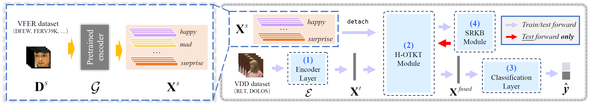

# Code for AFFAKT

> AAAI 2025 (Oral)

This is the PyTorch implementation of AAAI 2025 paper "AFFAKT: A Hierarchical Optimal Transport Based Method for Affective Facial Knowledge Transfer in Video Deception Detection".



## Installation
> - PyTorch
> - transformers
> - opencv-python
> - NumPy
> - SciPy
> - scikit-learn

## Data Preparation

🚨 ${\color{red}\text{NOTE:} }$***Please follow the policy of each dataset and send application form to the official for data permission. The data in our project are only used for scientific research.***

### Deception Datasets
The local data storage path should be consistent with that in `data/path_categ.py`.
#### Real-Life Trial Dataset (RLT)
> Verónica Pérez-Rosas, Mohamed Abouelenien, Rada Mihalcea, and Mihai Burzo. 2015. Deception Detection using Real-life Trial Data. In Proceedings of the 2015 ACM on International Conference on Multimodal Interaction (ICMI '15). Association for Computing Machinery, New York, NY, USA, 59–66. https://doi.org/10.1145/2818346.2820758

The dataset can be downloaded from [https://web.eecs.umich.edu/~mihalcea/downloads.html](https://web.eecs.umich.edu/~mihalcea/downloads.html).

#### DOLOS Dataset
> Guo, X., Selvaraj, N.M., Yu, Z., Kong, A., Shen, B. and Kot, A., 2023. Audio-Visual Deception Detection: DOLOS Dataset and Parameter-Efficient Crossmodal Learning. International Conference on Computer Vision (ICCV).

Please refer to their official GitHub [Repo](https://github.com/NMS05/Audio-Visual-Deception-Detection-DOLOS-Dataset-and-Parameter-Efficient-Crossmodal-Learning) for requesting data.

After downloading videos from URLs, please reformat the data to RLT-like storage format.

### Video Facial Expression Recognition Datasets
#### DFEW Dataset
> Xingxun Jiang, Yuan Zong, Wenming Zheng, Chuangao Tang, Wanchuang Xia, Cheng Lu, and Jiateng Liu. 2020. DFEW: A Large-Scale Database for Recognizing Dynamic Facial Expressions in the Wild. In Proceedings of the 28th ACM International Conference on Multimedia (MM '20). Association for Computing Machinery, New York, NY, USA, 2881–2889. https://doi.org/10.1145/3394171.3413620

Please refer to their official [page](https://dfew-dataset.github.io/) to request data.

#### FERV39K Dataset
> Y. Wang et al., "FERV39k: A Large-Scale Multi-Scene Dataset for Facial Expression Recognition in Videos," 2022 IEEE/CVF Conference on Computer Vision and Pattern Recognition (CVPR), New Orleans, LA, USA, 2022, pp. 20890-20899, doi: 10.1109/CVPR52688.2022.02025.

Please refer to their official GitHub [Repo](https://github.com/wangyanckxx/FERV39k) to request data.


#### MAFW Dataset
> Yuanyuan Liu, Wei Dai, Chuanxu Feng, Wenbin Wang, Guanghao Yin, Jiabei Zeng, and Shiguang Shan. 2022. MAFW: A Large-scale, Multi-modal, Compound Affective Database for Dynamic Facial Expression Recognition in the Wild. In Proceedings of the 30th ACM International Conference on Multimedia (MM '22). Association for Computing Machinery, New York, NY, USA, 24–32. https://doi.org/10.1145/3503161.3548190


Please refer to their official GitHub [Repo](https://github.com/MAFW-database/MAFW) to request data.


## Source Feature Preparation
Use [MAE-DFER](https://github.com/sunlicai/MAE-DFER) code and download the checkpoints. Then, follow their instructions to reproduce feature embeddings of VFER datasets. Save the *feature embeddings*, *ground truth labels* and *prediction probabilities* to local HDF5 file. The processed HDF5 file should be like:
```python
print(file.keys())  # Output: <KeysViewHDF5 ['features', 'labels', 'probs']>
print(file['features'][:].shape)  # Output: (num, 512)
print(file['labels'][:].shape)  # Output: (num,)
print(file['probs'][:].shape)  # Output: (num, 1, 7)
```

## Acknowledgment
Thanks for the previous excellent works (MAE-DFER *etc.* and datasets incorporated in our project) and open source code of [PECL](https://github.com/NMS05/Audio-Visual-Deception-Detection-DOLOS-Dataset-and-Parameter-Efficient-Crossmodal-Learning) and [Adaptive Distribution Calibration](https://github.com/DandanGuo1993/Adaptive-Distribution-Calibration-for-Few-Shot-Learning-with-Hierarchical-Optimal-Transport).


